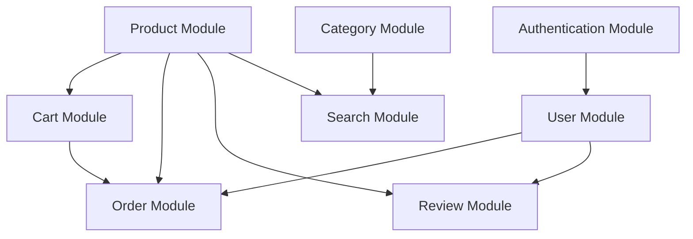

# E-commerce Module Documentation

## Table of Contents
1. [Core Modules](#core-modules)
2. [Feature Modules](#feature-modules)
3. [Module Dependencies](#module-dependencies)
4. [Module Configuration](#module-configuration)

## Core Modules

### Authentication Module
**Purpose:** Handles user authentication and authorization
**Dependencies:** None
**Database Tables:**
- users
- user_sessions
- user_tokens

**Features:**
- User registration
- User login
- Password reset
- Email verification
- Session management
- Token management
- Role-based access control

**Configuration:**
```json
{
  "jwt": {
    "secret": "your-secret-key",
    "expiresIn": "24h"
  },
  "password": {
    "saltRounds": 10
  },
  "session": {
    "maxAge": 86400000
  }
}
```

### Product Module
**Purpose:** Manages product catalog and inventory
**Dependencies:** None
**Database Tables:**
- products
- product_categories
- product_attributes
- product_images
- product_inventory

**Features:**
- Product CRUD operations
- Category management
- Attribute management
- Image management
- Inventory tracking
- Product search
- Product filtering

**Configuration:**
```json
{
  "image": {
    "maxSize": 5242880,
    "allowedTypes": ["image/jpeg", "image/png"],
    "storage": "s3"
  },
  "search": {
    "index": "products",
    "maxResults": 100
  }
}
```

### Category Module
**Purpose:** Manages product categories and hierarchy
**Dependencies:** None
**Database Tables:**
- categories
- category_attributes
- category_relations

**Features:**
- Category CRUD operations
- Category hierarchy
- Category attributes
- Category images
- Category search

**Configuration:**
```json
{
  "maxDepth": 5,
  "image": {
    "maxSize": 2097152,
    "allowedTypes": ["image/jpeg", "image/png"]
  }
}
```

## Feature Modules

### Cart Module
**Purpose:** Manages shopping cart functionality
**Dependencies:** Product Module
**Database Tables:**
- carts
- cart_items

**Features:**
- Cart creation
- Add to cart
- Remove from cart
- Update cart
- Cart calculation
- Cart persistence
- Cart sharing

**Configuration:**
```json
{
  "maxItems": 100,
  "maxQuantity": 10,
  "expiry": 604800,
  "calculation": {
    "includeTax": true,
    "includeShipping": false
  }
}
```

### Order Module
**Purpose:** Manages order processing and fulfillment
**Dependencies:** Cart Module, Product Module
**Database Tables:**
- orders
- order_items
- order_status
- order_payments
- order_shipping

**Features:**
- Order creation
- Order status management
- Payment processing
- Shipping management
- Order history
- Order tracking
- Order cancellation
- Order returns

**Configuration:**
```json
{
  "status": {
    "flow": ["pending", "processing", "shipped", "delivered"],
    "autoCancel": 86400
  },
  "payment": {
    "methods": ["credit_card", "paypal"],
    "timeout": 1800
  },
  "shipping": {
    "methods": ["standard", "express"],
    "calculation": "weight"
  }
}
```

### User Module
**Purpose:** Manages user profiles and preferences
**Dependencies:** Authentication Module
**Database Tables:**
- user_profiles
- user_addresses
- user_preferences
- user_wishlist

**Features:**
- Profile management
- Address management
- Preference management
- Wishlist management
- Order history
- Review management

**Configuration:**
```json
{
  "profile": {
    "requiredFields": ["firstName", "lastName", "email"],
    "optionalFields": ["phone", "birthday"]
  },
  "address": {
    "maxAddresses": 5,
    "requiredFields": ["street", "city", "country", "zipCode"]
  }
}
```

### Review Module
**Purpose:** Manages product reviews and ratings
**Dependencies:** Product Module, User Module
**Database Tables:**
- reviews
- review_ratings
- review_images
- review_reports

**Features:**
- Review creation
- Rating management
- Review moderation
- Review reporting
- Review analytics
- Review search

**Configuration:**
```json
{
  "rating": {
    "min": 1,
    "max": 5,
    "requirePurchase": true
  },
  "moderation": {
    "autoApprove": false,
    "maxReports": 5
  },
  "content": {
    "minLength": 10,
    "maxLength": 1000,
    "allowImages": true
  }
}
```

### Search Module
**Purpose:** Provides advanced search functionality
**Dependencies:** Product Module, Category Module
**Database Tables:**
- search_index
- search_logs
- search_suggestions

**Features:**
- Full-text search
- Faceted search
- Search suggestions
- Search analytics
- Search customization
- Search optimization

**Configuration:**
```json
{
  "engine": "elasticsearch",
  "index": {
    "products": {
      "fields": ["name", "description", "category", "attributes"],
      "weights": {
        "name": 10,
        "description": 5,
        "category": 3,
        "attributes": 2
      }
    }
  },
  "suggestions": {
    "maxResults": 5,
    "minLength": 2
  }
}
```

### Notification Module
**Purpose:** Manages system notifications
**Dependencies:** None
**Database Tables:**
- notifications
- notification_templates
- notification_logs

**Features:**
- Email notifications
- SMS notifications
- Push notifications
- In-app notifications
- Notification templates
- Notification scheduling
- Notification tracking

**Configuration:**
```json
{
  "channels": {
    "email": {
      "provider": "sendgrid",
      "templates": true
    },
    "sms": {
      "provider": "twilio",
      "templates": true
    },
    "push": {
      "provider": "firebase",
      "templates": true
    }
  },
  "scheduling": {
    "maxRetries": 3,
    "retryDelay": 300
  }
}
```

## Module Dependencies

### Dependency Graph


### Optional Dependencies
- Cart Module can work without Product Module (using product IDs)
- Order Module can work without Cart Module (direct order creation)
- Review Module can work without User Module (anonymous reviews)
- Search Module can work without Category Module (basic search)

## Module Configuration

### Global Configuration
```json
{
  "modules": {
    "enabled": [
      "auth",
      "product",
      "category",
      "cart",
      "order",
      "user",
      "review",
      "search",
      "notification"
    ],
    "default": {
      "language": "en",
      "currency": "USD",
      "timezone": "UTC"
    }
  }
}
```

### Module Activation
```json
{
  "module": {
    "name": "cart",
    "enabled": true,
    "config": {
      "maxItems": 100,
      "maxQuantity": 10
    },
    "dependencies": {
      "product": {
        "required": false,
        "version": ">=1.0.0"
      }
    }
  }
}
```

### Module Communication
- Event-based communication
- Message queue for async operations
- API endpoints for direct communication
- Shared configuration for common settings 